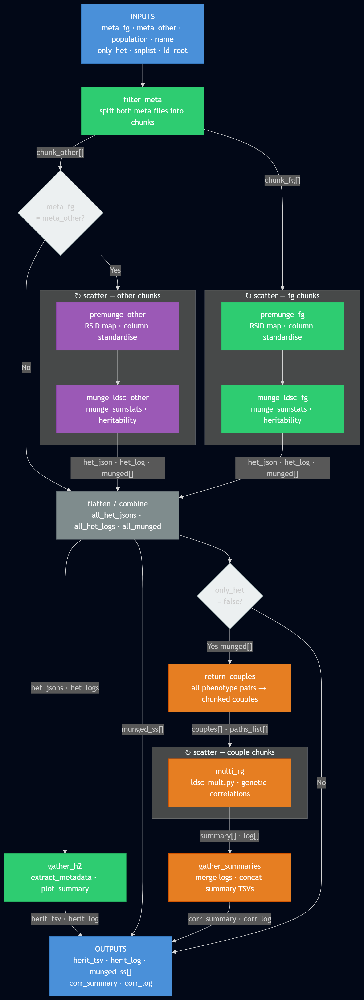

w# LDSC

Wrapper pipeline based on https://github.com/bulik/ldsc.

Most of the work is done by the wdl itself, but some preprocessing steps are needed, mainly due to the fact that the nature of the input sumstats can be different.

## WDL
The wdl takes a list of sumstats and generates heritabilities and (optional) genetic correlation between all N(N-1)/2 pairs or if two separate lists are passed then only between cross N*M pairs.



### Inputs

**Global parameters**

| Parameter | Default | Description |
|-----------|---------|-------------|
| `ldsc_rg.meta_fg` | — | Metadata table for primary summary statistics (TSV). |
| `ldsc_rg.meta_other` | — | Metadata table for secondary sumstats. Pass the same file as `meta_fg` for a self-comparison. |
| `ldsc_rg.name` | — | Output prefix for result files. |
| `ldsc_rg.only_het` | — | If `true`, computes only heritabilities (not genetic correlations). |
| `ldsc_rg.population` | — | Population label used to resolve the LD score file (e.g., `FIN`, `EUR`). |
| `ldsc_rg.docker` | `eu.gcr.io/finngen-sandbox-v3-containers/ldsc:rsid_munge` | Docker image used for all pipeline tasks. |
| `ldsc_rg.ld_root` | `gs://finngen-production-library-green/ldsc/POP_ld.txt` | GCS path template for LD score file lists; `POP` is replaced by `population`. |
| `ldsc_rg.snplist` | `gs://finngen-production-library-green/ldsc/w_hm3.snplist` | SNP list file for LD score regression. |
| `ldsc_rg.filter_chunk_size` | `30` | Number of phenotypes per premunge/munge scatter shard. Use smaller values for testing. |
| `ldsc_rg.couples_chunk_size` | `500` | Number of pairs per `multi_rg` scatter shard. Use smaller values for testing. |
| `ldsc_rg.multi_rg.cpus` | — | Number of CPUs per `multi_rg` shard. |
| `ldsc_rg.munge_fg.args` | — | (Optional) Extra arguments passed to `ldsc.py` for the fg munge step. |
| `ldsc_rg.munge_other.args` | — | (Optional) Extra arguments passed to `ldsc.py` for the other munge step. |
| `ldsc_rg.multi_rg.args` | — | (Optional) Extra arguments passed to `ldsc.py` for the rg step. |

**Premunge parameters — primary list (`meta_fg`)**

| Parameter | Description |
|-----------|-------------|
| `ldsc_rg.premunge_fg.beta_col` | Column name for effect size (beta). |
| `ldsc_rg.premunge_fg.p_col` | Column name for p-value. |
| `ldsc_rg.premunge_fg.a1_effect_col` | Column name for effect allele. |
| `ldsc_rg.premunge_fg.a2_ne_col` | Column name for non-effect allele. |
| `ldsc_rg.premunge_fg.rsid_col` | (Optional) Column name for rsIDs. |
| `ldsc_rg.premunge_fg.chrom_col` | (Optional) Column name for chromosome (required if no rsID column). |
| `ldsc_rg.premunge_fg.pos_col` | (Optional) Column name for position (required if no rsID column). |

**Premunge parameters — secondary list (`meta_other`)**

Only required when `meta_other` differs from `meta_fg`. The parameters mirror those above:

| Parameter | Description |
|-----------|-------------|
| `ldsc_rg.premunge_other.beta_col` | Column name for effect size (beta). |
| `ldsc_rg.premunge_other.p_col` | Column name for p-value. |
| ... | ... |


The metadata tables should be  structured as `PHENO\tPATH\tN` where `N` is the total number of valid cases+controls of each pheno.
```
C3_BREAST_EXALLC	gs://fg-cromwell_fresh/munge_fg/d17c3b71-2510-4d89-8bfb-3f788b50bd59/call-munge/shard-0/C3_BREAST_EXALLC.premunge.gz	110611
C3_BRONCHUS_LUNG_EXALLC	gs://fg-cromwell_fresh/munge_fg/d17c3b71-2510-4d89-8bfb-3f788b50bd59/call-munge/shard-1/C3_BRONCHUS_LUNG_EXALLC.premunge.gz	180418
C3_PROSTATE_EXALLC	gs://fg-cromwell_fresh/munge_fg/d17c3b71-2510-4d89-8bfb-3f788b50bd59/call-munge/shard-2/C3_PROSTATE_EXALLC.premunge.gz	83146
G6_PARKINSON	gs://fg-cromwell_fresh/munge_fg/d17c3b71-2510-4d89-8bfb-3f788b50bd59/call-munge/shard-3/G6_PARKINSON.premunge.gz	224566
H7_AMD	gs://fg-cromwell_fresh/munge_fg/d17c3b71-2510-4d89-8bfb-3f788b50bd59/call-munge/shard-4/H7_AMD.premunge.gz	214660
```

### Munging

The wdl now contains internally a `premunge_ss` step where input sumstats are processed to match the LDSC notation, which is 

```
SNP	A1	A2	BETA	P
rs74337086	A	G	0.0923	0.5059
rs76388980	A	G	0.1227	0.2945
rs562172865	T	C	-0.0262	0.8142
rs780596509	A	G	-0.2202	0.1545
rs778009914	A	G	-0.3938	0.3044
rs564223368	T	C	0.2195	0.03913
rs71628921	C	A	0.1763	0.3682
rs577189614	A	G	0.0845	0.5341
rs77357188	T	C	-0.0414	0.3383
```


Therefore now the the inputs also require to pass the relevant column names for the munging. In case the data is not in rsid format, the script will automatically map chrom/pos --> rsid if needed. `chrom_col` and `pos_col` are required *only* if the `rsid_col` is missing

### Long description

A brief summary of the logic of the wdl.

`only_het` if set to `true` only produces heritabilities and does not compute genetic correlations. Please make sure it's your intention to compute correlations before setting it to `false`.

Both `meta_fg` and `meta_other` are always required. Pass the same file for both to run a self-comparison (all N(N-1)/2 pairs within the list). Pass two different files to run a cross-comparison (N*M pairs). The growth is quadratic so it is recommended to test with a smaller set first.

`filter_meta` splits each input list into chunks of `filter_chunk_size` phenotypes. The two lists are chunked independently. If the files are identical the second scatter is skipped entirely. This step is fast and its output is cached.

Each chunk is passed in parallel to `premunge_ss` (`premunge_fg` for `meta_fg`, `premunge_other` for `meta_other`) which prepares the sumstats for ldsc as described above. Column name inputs are specified per call, allowing the two lists to have different formats.

Each premunged chunk is passed to `munge_ldsc` which runs ldsc munging and computes per-phenotype heritability. The heritability outputs from both scatter arms are combined and passed to `gather_h2`, which builds a summary table, JSON, and merged logs.

`return_couples` builds all unique phenotype pairs across the two lists, splits them into chunks of `couples_chunk_size` pairs each, and for each chunk produces the subset of munged sumstat paths required — so only the necessary files are localized per shard.

Each chunk of pairs is passed to `multi_rg` where a wrapper script runs `ldsc.py --rg` in parallel. Increasing CPUs via `ldsc_rg.multi_rg.cpus` speeds up each shard.

Finally `gather_summaries` merges all `multi_rg` outputs into a single table and log:
```
p1	p2	rg	se	z	p	h2_obs	h2_obs_se	h2_int	h2_int_se	gcov_int	gcov_int_se
AB1_AMOEBIASIS	AB1_AMOEBIASIS	1.0006	0.0009	1139.1313	0.0	0.0009	0.0013	0.9682	0.0061	0.9682	0.0061
AB1_AMOEBIASIS	AB1_ANOGENITAL_HERPES_SIMPLEX	0.5613	0.7023	0.7992	0.4242	0.0039	0.0015	0.9872	0.0069	0.0007	0.0044
AB1_AMOEBIASIS	AB1_ARTHROPOD	-1.0562	1.0868	-0.9718	0.3311	0.0024	0.0015	0.9977	0.0071	0.0089	0.005
AB1_AMOEBIASIS	AB1_ASPERGILLOSIS	0.7488	0.9701	0.7719	0.4402	0.0019	0.0016	0.981	0.0065	-0.0074	0.0048
```

### LD scores

The LD score file is resolved from `ld_root` by substituting `POP` with the value of `population`. Set `population` to `fin` or `eur` to use the prebuilt FinnGen or 1000 Genomes European LD scores respectively.

`ldsc_rg.multi_rg.args` is an optional input for passing extra flags directly to `ldsc.py`.
