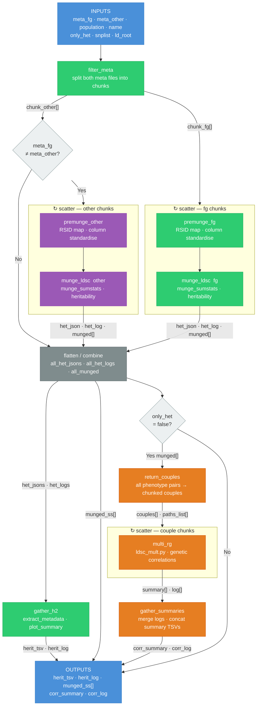

# ldsc_rg Workflow



## Colour key

| Colour | Meaning |
|--------|---------|
| Blue | Workflow inputs / outputs |
| Green | Unconditional task |
| Purple | Conditional task — runs only when `meta_fg ≠ meta_other` |
| Orange | Conditional task — runs only when `only_het = false` |
| Gray | Flatten / combine step |
```
